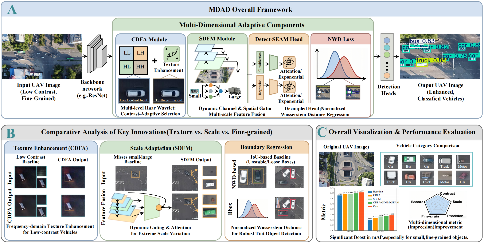
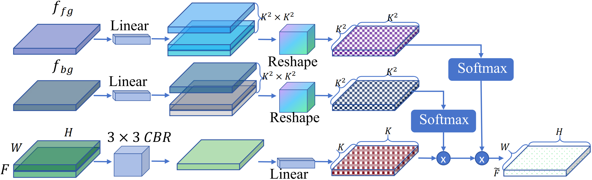
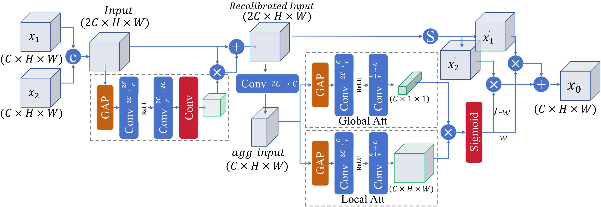
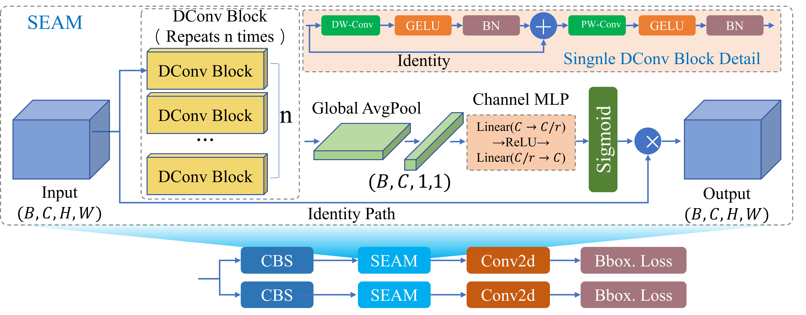
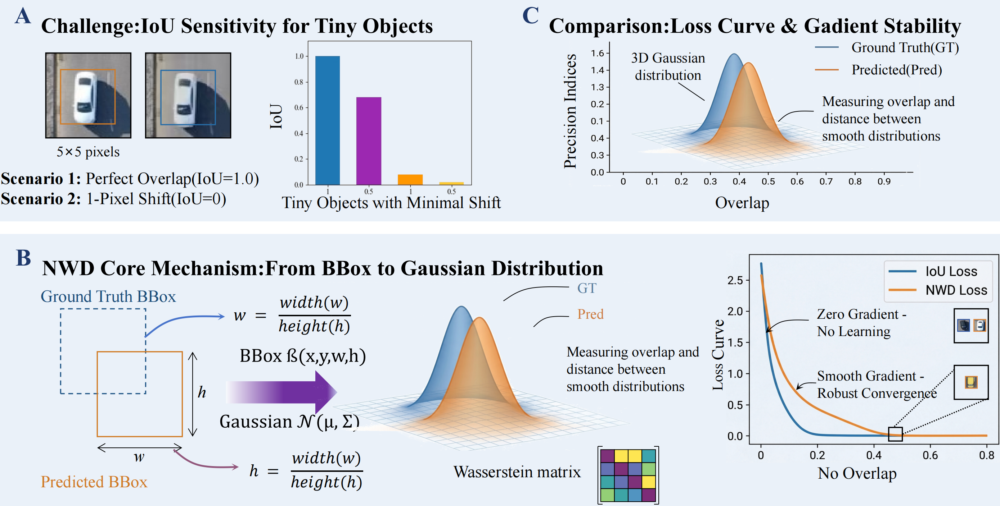
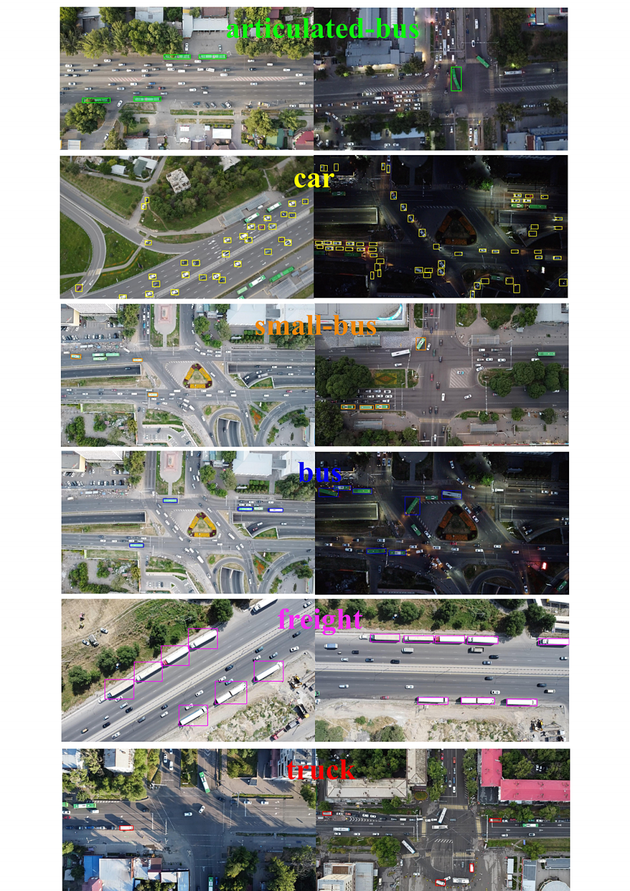

## A Multi-Dimensional Adaptive Detector for Low-Altitude Fine-Grained Vehicles
This repository(MDAD) is the official PyTorch implementation of the paper "A Multi-Dimensional Adaptive Detector for Low-Altitude Fine-Grained Vehicles".  

---
<p align="center">
  
  <br>
  <em>Overall architecture of the proposed Multi-Dimensional Adaptive Detector for Low-Altitude Fine-Grained Vehicles.</em>
</p>

<table align="center">
  <tr>
    <td align="center">
      <br>
      <em>The schematic diagram of the Contrast-Driven Feature Aggregation (CDFA) module.</em>
    </td>
    <td align="center">
      <br>
      <em>The detailed structure of the Scale-Aware Dynamic Fusion Module.</em>
    </td>
  </tr>
  <tr>
    <td align="center">
      <br>
      <em>The detailed structure of the Semantic Enhancement and Aggregation Module.</em>
    </td>
    <td align="center">
      <br>
      <em>Visualization of Gaussian modeling and Wasserstein distance calculation for bounding boxes.</em>
    </td>
  </tr>
</table>

---


## Dataset

To comprehensively evaluate the performance of the proposed method in complex aerial scenarios, we utilize a specialized aerial vehicle dataset comprising 2,698 high-resolution images captured by UAVs from top-down perspectives. The dataset covers diverse scenes, including urban roads, highways, and parking lots, under varying lighting conditions. It focuses on six key vehicle categories (articulated-bus, car, small-bus, bus, freight, and truck), with filtering applied to emphasize fine-grained classification challenges. Representative visual samples of these categories are illustrated in Figure 6. The dataset exhibits typical aerial characteristics such as extremely small object sizes, high density, and significant fine-grained visual confusion. Following a standard protocol, the dataset is randomly divided into training, validation, and testing sets with a ratio of 7:1:2.

---

##### Task1: Performance Comparison of Different Feature Enhancement Strategies on Backbone.

| Backbone (Improvement 1)                   | mAP@50 ↑ | mAP@50:95 ↑ |
|-------------------------------------------|----------|-------------|
| YOLOv11 (Baseline)                        | 0.828    | 0.602       |
| + Adaptive Fine-Grained Channel Attention | 0.830    | 0.611       |
| + Channel Prior Convolutional Attention   | 0.838    | 0.608       |
| + MultiPath Coordinate Attention          | 0.830    | 0.603       |
| + SimAM                                   | 0.830    | 0.605       |
| + TripletAttention                        | 0.832    | 0.604       |
| + BiLevelRoutingAttention                 | 0.825    | 0.605       |
| + Vision Transformer w/ Deformable Attn   | 0.838    | 0.610       |
| + Contrast Driven Feature Aggregation     | **0.840**| **0.616**   |


##### Task2: Ablation Study on High-Level and Low-Level Feature Fusion Mechanisms.

| High-Level and Low-Level FeatureFusion (Improvement 2)      | mAP@50 ↑ | mAP@50:95 ↑ |
|--------------------------|----------|-------------|
| YOLO + CDFA (Baseline)   | 0.840    | 0.616       |
| + CGAFusion              | 0.841    | 0.614       |
| **+ SDFM**        | **0.843**| **0.631**   |
  

##### Task3: Impact of Different Detection Head Architectures on Detection Performance.

| Detection Head (Improvement 3)          | mAP@50 ↑ | mAP@50:95 ↑ |
|--------------------------------|----------|-------------|
| YOLO + CDFA + SDFM (Baseline)  | 0.843    | 0.631       |
| + Detect-MultiSEAM             | 0.826    | 0.596       |
| + Detect-LADH                  | 0.824    | 0.594       |
| + Detect-RSCD                  | 0.780    | 0.532       |
| + Detect-LSCD                  | 0.843    | 0.621       |
| **+ Detect-SEAM**       | **0.848**| **0.635**   |
  

##### Task4: Comparative Analysis of Different Bounding Box Regression Loss Functions.

| Loss Function(Improvement 4)     | mAP@50 ↑ | mAP@50:95 ↑ |
|--------------------------------------|----------|-------------|
| YOLO + CDFA + SDFM + SEAM (Baseline) | 0.848    | 0.635       |
| + GIoU                               | 0.844    | 0.616       |
| + DIoU                               | 0.837    | 0.611       |
| + EIoU                               | 0.840    | 0.604       |
| + SIoU                               | 0.839    | 0.603       |
| + ShapeIoU                           | 0.845    | 0.616       |
| **+ NWD**                     | **0.857**| **0.642**   |


##### Task5: Robustness Evaluation Under Varying Model Scales and Input Resolution.

| Model Size | Image Size | mAP@50 ↑           | mAP@50:95 ↑        |
|------|-----------|--------------------|--------------------|
|    | 640       | 0.828 / 0.857 (+2.9%) | 0.602 / 0.642 (+4.0%) |
| n    | 960       | 0.882 / 0.906 (+2.4%) | 0.653 / 0.673 (+2.0%) |
|     | 1280      | 0.900 / 0.917 (+1.7%) | 0.684 / 0.695 (+1.1%) |
|     | 640       | 0.876 / 0.901 (+2.5%) | 0.651 / 0.669 (+1.8%) |
| s    | 960       | 0.920 / 0.932 (+1.2%) | 0.708 / 0.727 (+1.9%) |
|     | 1280      | 0.924 / 0.935 (+1.1%) | 0.727 / 0.741 (+1.4%) |
|     | 640       | 0.890 / 0.903 (+1.3%) | 0.682 / 0.696 (+1.4%) |
| m    | 960       | 0.924 / 0.937 (+1.3%) | 0.732 / 0.744 (+1.2%) |
|     | 1280      | 0.926 / 0.940 (+1.4%) | 0.743 / 0.757 (+1.4%) |


##### Task6: Comparison with Aerial-Specific SOTA Methods on Aerial Vehicle Dataset.

| Method            | mAP@50 ↑ | mAP@50:95 ↑ |
|----------------------|----------|-------------|
| YOLOv11-n (Baseline) | 0.828    | 0.602       |
| UAV-YOLO             | 0.835    | 0.610       |
| Drone-YOLO           | 0.840    | 0.615       |
| TPH-YOLOv5-Air       | 0.846    | 0.625       |
| EBR-YOLO             | 0.843    | 0.620       |
| YOLO-DD              | 0.850    | 0.630       |
| **Ours**             | **0.857**| **0.642**   |


---
### Visualization of the six fine-grained vehicle categories in the specialized dataset.
<p align="center">
  
  <br>
</p>
---

### Training

```
python ./ultralytics/train.py
```
### Evaluation

```
python ./ultralytics/val.py
```
### Prediction

```
python ./ultralytics/predict.py
```


## Description of MSCL-SwinUNet

If you have any question, please discuss with me by sending email to wq@cap.edu.cn.


# References
Many thanks to their excellent works


* **YOLOv11** – [Code](https://github.com/ultralytics/ultralytics)


